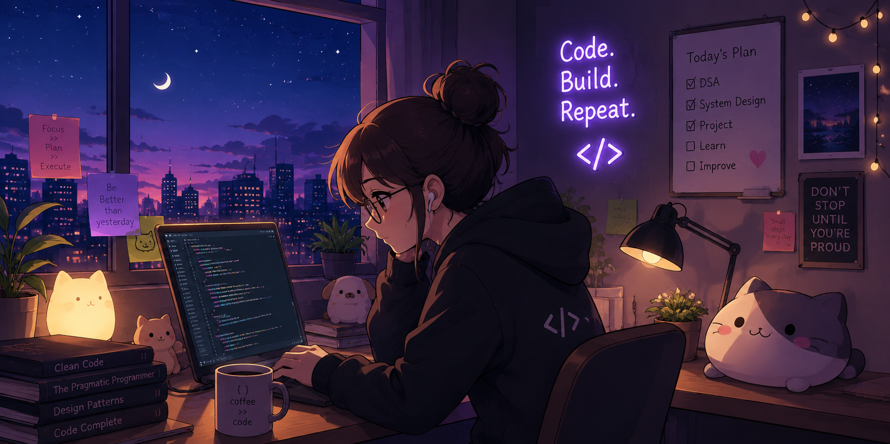

# Hi, I'm Kanishka 👋

### Software Developer | Problem Solver | Tech Enthusiast

---

---

## 🌸 About Me

* 🎓 B.Tech Information Technology student at NIT Srinagar
* 💻 Passionate about Software Development and Problem Solving
* 🧩 Currently strengthening my DSA and problem-solving skills
* ☁️ Exploring Backend Development, Cloud and Cybersecurity
* 🚀 Building projects that solve real-world problems

---

## 🛠️ Tech Stack

### Languages

### Web & Backend

### Tools & Technologies

---

## 🚀 Featured Projects

### 🎓 Campus Placement & Career Management Platform

A full-stack platform designed to manage campus placement activities and career-related workflows.

**Tech:** React.js • Spring Boot • Java • MySQL • JWT • Docker • AWS

---

### 🌐 Network Simulator

A Python-based networking project designed to simulate and understand network concepts.

**Tech:** Python

---

### ✈️ Travel Recommendation System

A machine-learning based system that recommends travel destinations based on user preferences.

**Tech:** Python • Scikit-learn • Pandas • NumPy

---

## 📊 GitHub Stats

 

---

## 💗 Let's Connect

---

### ✨ Thanks for visiting my profile!

